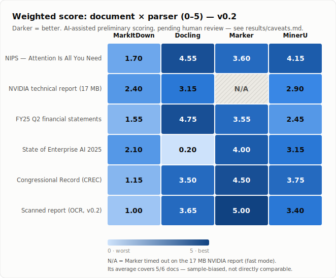

# Document Parser Benchmark

> An open, reproducible benchmark of open-source document parsers for RAG & LLM pipelines. Real documents, real failures, honest scores.

[](./results/benchmark-v0.2.md)
[](./benchmarks/documents)
[](#tested-parsers)
[](./results/caveats.md)
[](./LICENSE)

Document parsing is the single biggest source of silent failures in RAG pipelines. A parser that scrambles reading order, drops tables, or flattens headings produces clean-looking Markdown that quietly destroys retrieval quality. This project measures exactly that — on real documents, with the failures left in.

**v0.2** removes the two biggest v0.1 biases (Docling base64 bloat, Marker timeouts) and adds the first OCR test. See [`results/benchmark-v0.1.md`](results/benchmark-v0.1.md) for the v0.1 archive.

---

## TL;DR

We ran **4 open-source parsers** on **6 PDFs** (academic, financial, technical, image-heavy, dense-text, and a **scanned/OCR** document) and scored every output on **5 dimensions weighted for RAG quality**.

| Rank | Parser | Weighted (0–5) | Docs | Reliability | Avg time | Best for |
|:---:|---|:---:|:---:|:---:|:---:|---|
| 🥇 | **Marker** | **4.13** ⚠️ | 5/6 | 5/6 ⚠️ | 170s | Structure, layout & scanned tables (slow, big-file timeout) |
| 🥈 | **Docling** | **3.30** | 6/6 | 6/6 ✅ | 64s | Tables, financial docs, clean-scan OCR |
| 🥈 | **MinerU** | **3.30** | 6/6 | 6/6 ✅ | 72s | General-purpose — balanced, no blow-ups |
| 4 | **MarkItDown** | 1.65 | 6/6 | 6/6 ✅ | 1.5s | Fast drafts only (no OCR, low quality) |

> ⚠️ **Marker's 4.13 is still not directly comparable.** Even in `--mode fast` it **times out on the 17 MB NVIDIA report**, so it's scored on 5/6 documents while skipping the largest file. **On a level playing field (all six documents), Docling and MinerU tie at 3.30 as the strongest overall.** Full breakdown: [`results/caveats.md`](results/caveats.md).

---

## Why this project?

Most parser comparisons show a tidy table of green checkmarks. The interesting information lives in what *fails*: which parser turns a financial table into garbage, which one returns nothing from a scanned page, which one hangs for 20 minutes on a large file. We report those failures, because that's what actually matters when you pick a parser for production RAG.

Poor extraction quality cascades into:

- broken document structure and reading order
- lost or corrupted tables
- missing heading hierarchy
- bad chunk boundaries
- inaccurate retrieval, and wrong LLM answers

---

## Tested parsers

| Parser | Repo | Role |
|---|---|---|
| **MinerU** | [opendatalab/MinerU](https://github.com/opendatalab/MinerU) | PDF parsing + OCR framework |
| **Docling** | [docling-project/docling](https://github.com/docling-project/docling) | Document intelligence toolkit |
| **Marker** | [VikParuchuri/marker](https://github.com/VikParuchuri/marker) | PDF parser with strong layout understanding |
| **MarkItDown** | [microsoft/markitdown](https://github.com/microsoft/markitdown) | Document-to-Markdown converter |

The runner is [`scripts/run_benchmark.py`](scripts/run_benchmark.py). It invokes each parser's CLI, times every run, and records success/failure plus output size.

---

## Methodology

Each parser output is scored **0–5** on five dimensions, weighted toward what actually moves RAG quality:

| Dimension | Weight | What it measures |
|---|:---:|---|
| Reading Order | 30% | Multi-column flow, logical sequence preserved |
| Heading Structure | 20% | Hierarchy detected, nesting correct |
| Table Extraction | 25% | Tables survive as usable Markdown, values intact |
| OCR Quality | 15% | Text accuracy, math/equations, no garbling |
| Markdown Quality | 10% | Cleanliness, spacing, no base64 bloat, RAG-readiness |

Scores are an **AI-assisted preliminary assessment** of the actual Markdown outputs, **pending human review**. For the scanned document, OCR accuracy is also measured **objectively** as char-level similarity vs a known ground truth (`scripts/ocr_accuracy.py`). Full rubric and per-document scores: [`results/scoring-v0.2.md`](results/scoring-v0.2.md).

**v0.2 settings:** Docling `--image-export-mode placeholder` (v0.1 used `embedded`, which inlined base64); Marker `--mode fast` (v0.1 used `balanced`, whose VLM timed out on large files).

---

## Results

### Per-document weighted scores (0–5)



| Document | Type | MarkItDown | Docling | Marker | MinerU |
|---|---|:---:|:---:|:---:|:---:|
| NIPS — Attention Is All You Need | Multi-column academic | 1.70 | **4.55** | 3.60 | 4.15 |
| NVIDIA technical report (17 MB) | Technical, large | 2.40 | **3.15** | ⏱ N/A | 2.90 |
| FY25 Q2 financial statements | Tables | 1.55 | **4.75** | 3.55 | 2.45 |
| State of Enterprise AI 2025 | Image-heavy | 2.10 | 0.20 | **4.00** | 3.15 |
| Congressional Record (CREC) | Dense text | 1.15 | 3.50 | **4.50** | 3.75 |
| Scanned report (OCR, new) | Scanned | 1.00 | 3.65 | **5.00** | 3.40 |

### OCR accuracy on the scanned document (objective)

| Parser | Char similarity | Word recall | Scanned table |
|---|:---:|:---:|---|
| docling | **0.988** | 0.971 | collapsed to one line |
| marker | 0.964 | 0.993 | **perfect Markdown pipe table** |
| mineru | 0.898 | **1.000** | HTML `<table>` mess |
| markitdown | 0.000 | 0.000 | — (no OCR; returned 1 char) |

### Speed & reliability

| Parser | Success | Avg time | Best time |
|---|:---:|:---:|:---:|
| MarkItDown | 6/6 | 1.48s | 0.32s |
| Docling | 6/6 | 64.04s | 11.55s |
| Marker | 5/6 | 170.20s | 5.52s |
| MinerU | 6/6 | 71.82s | 21.8s |

> Marker's average excludes the timed-out NVIDIA file. Two surprises worth knowing: **Docling OCRs a clean scan best (0.988)** despite failing on the complex image-heavy report, and **Marker reconstructed the scanned table perfectly via OCR** — the best table result in the benchmark.

Full raw data: [`results/benchmark-report.md`](results/benchmark-report.md) · [`results/benchmark-report.csv`](results/benchmark-report.csv)

---

## How to pick a parser

| You need… | Use | Caveat |
|---|---|---|
| A safe default / general purpose | **MinerU** | Tables come out as HTML, not Markdown pipes |
| Best tables & financial docs | **Docling** | Won't OCR complex image-heavy pages |
| Best structure, layout & scanned tables | **Marker** | Slow; large files time out even in fast mode |
| OCR of a clean scan | **Docling** or **Marker** | Avoid MarkItDown (no OCR at all) |
| A fast rough draft | **MarkItDown** | Expect broken tables, missing headings, no OCR |

---

## Reproduce

See [`REPRODUCING.md`](REPRODUCING.md) for environment setup, the isolated-install notes for each parser, and the exact v0.2 commands. Quick start:

```bash
python scripts/run_benchmark.py --timeout 1200
# v0.2 de-biased reruns:
python scripts/run_benchmark.py --tools docling --docling-image-mode placeholder --timeout 1200
python scripts/run_benchmark.py --tools marker --marker-mode fast --timeout 1200
```

---

## Related project

[**DocCrush**](https://doccrush.com) — an online document processing workflow that converts documents into clean Markdown optimized for AI/RAG applications. This benchmark exists to be honest about the trade-offs in the open-source landscape.

---

## Contributing

Found a parser failure we missed? Have a document that breaks these tools in a new way? Open an issue with the document and the parser output, or submit a pull request. We especially welcome:

- additional challenging documents (with permission to redistribute)
- corrections to the AI-assisted scores after human review
- new parsers added to the runner

## License

[MIT](./LICENSE) — both the benchmark code and the curated results. Individual source documents retain their original licenses; the synthesized `scanned-report-cc0.pdf` and its ground truth are CC0 (see [`benchmarks/documents/README.md`](benchmarks/documents/README.md)).
